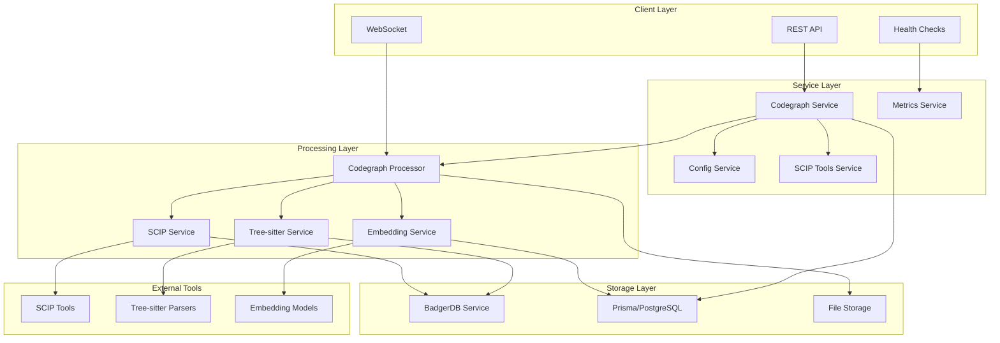
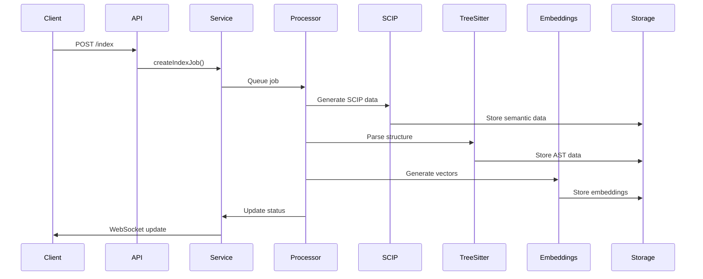
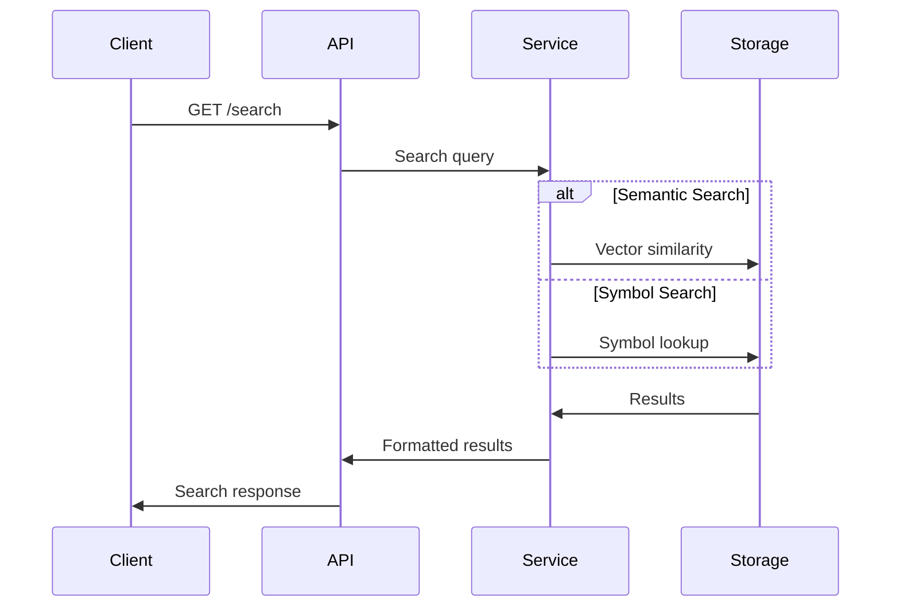

# Codegraph Architecture

This document describes the architecture and design principles of the Codegraph module in TekAIContextEngine2.

## Overview

The Codegraph module is designed to provide comprehensive code analysis and indexing capabilities by combining multiple complementary technologies:

1. **SCIP (SCIP Code Intelligence Protocol)** - Semantic analysis and symbol relationships
2. **Tree-sitter** - Fast, incremental parsing for structural analysis
3. **Vector Embeddings** - Semantic search and similarity matching
4. **BadgerDB** - High-performance storage for indexed data

## System Architecture

## Component Details

### 1. API Layer

#### CodegraphController
- **Purpose**: HTTP API endpoints for codegraph operations
- **Responsibilities**:
  - Job creation and management
  - Configuration management
  - Search and query operations
  - Metrics and monitoring
- **Dependencies**: CodegraphService, ConfigService, MetricsService

#### WebSocket Integration
- **Purpose**: Real-time progress updates
- **Events**: indexProgress, indexComplete, indexError
- **Integration**: Via WebSocketService

### 2. Service Layer

#### CodegraphService
- **Purpose**: Main orchestration service
- **Responsibilities**:
  - Job lifecycle management
  - Queue integration
  - Status tracking
  - Error handling
- **Key Methods**:
  - `createIndexJob()` - Create and queue indexing jobs
  - `getIndexJob()` - Retrieve job status
  - `cancelIndexJob()` - Cancel running jobs

#### CodegraphConfigService
- **Purpose**: Configuration management
- **Responsibilities**:
  - Per-codebase configuration
  - Default settings
  - Validation
- **Storage**: PostgreSQL via Prisma

#### ScipToolsService
- **Purpose**: SCIP tools management
- **Responsibilities**:
  - Tool availability checking
  - Installation assistance
  - Configuration validation
- **Features**:
  - Automatic tool detection
  - Version checking
  - Installation instructions

#### CodegraphMetricsService
- **Purpose**: Performance monitoring
- **Responsibilities**:
  - Metrics collection
  - Performance analysis
  - Historical data
- **Metrics**:
  - Indexing performance
  - Storage statistics
  - Language distribution
  - Error rates

### 3. Processing Layer

#### CodegraphProcessor
- **Purpose**: Background job processing
- **Responsibilities**:
  - Job execution
  - Progress tracking
  - Error recovery
  - Parallel processing
- **Job Types**:
  - `EMBEDDING` - Vector embedding generation
  - `SCIP` - SCIP analysis only
  - `TREE_SITTER` - Tree-sitter parsing only
  - `CODEGRAPH` - Combined processing

#### ScipService
- **Purpose**: SCIP integration and processing
- **Responsibilities**:
  - Language detection
  - Build environment preparation
  - SCIP tool execution
  - Result parsing
- **Supported Languages**:
  - TypeScript/JavaScript
  - Python
  - Go
  - Java
  - Rust

#### TreeSitterService
- **Purpose**: Code structure analysis
- **Responsibilities**:
  - AST parsing
  - Symbol extraction
  - Import/export analysis
  - Error handling
- **Features**:
  - Multi-language support
  - Incremental parsing
  - Symbol relationships
  - Metadata extraction

#### EmbeddingService
- **Purpose**: Vector embedding generation
- **Responsibilities**:
  - Text chunking
  - Embedding generation
  - Storage management
- **Features**:
  - Configurable chunk sizes
  - Overlap handling
  - Batch processing

### 4. Storage Layer

#### BadgerDbService
- **Purpose**: High-performance key-value storage
- **Responsibilities**:
  - SCIP data storage
  - Tree-sitter results
  - Symbol indexing
  - Fast retrieval
- **Key Prefixes**:
  - `doc:` - SCIP documents
  - `sct:` - Tree-sitter structures
  - `sym:` - Symbol information
  - `sym_index:` - Symbol mappings

#### PostgreSQL Integration
- **Purpose**: Relational data storage
- **Tables**:
  - `index_history` - Job tracking
  - `vector_embeddings` - Embedding storage
  - `codegraph_configs` - Configuration
- **Features**:
  - ACID compliance
  - Complex queries
  - Relationship management

## Data Flow

### 1. Indexing Workflow

### 2. Search Workflow

## Design Principles

### 1. Modularity
- **Separation of Concerns**: Each service has a specific responsibility
- **Loose Coupling**: Services communicate through well-defined interfaces
- **Pluggable Architecture**: Easy to add new analysis tools

### 2. Scalability
- **Horizontal Scaling**: Queue-based processing supports multiple workers
- **Efficient Storage**: BadgerDB for fast key-value operations
- **Batch Processing**: Optimized for large codebases

### 3. Reliability
- **Error Recovery**: Graceful handling of tool failures
- **Progress Tracking**: Detailed status reporting
- **Data Consistency**: Transactional operations where needed

### 4. Performance
- **Concurrent Processing**: Parallel execution of analysis tasks
- **Incremental Updates**: Only process changed files
- **Caching**: Multiple levels of caching for fast access

### 5. Extensibility
- **Plugin Architecture**: Easy to add new languages
- **Configuration**: Flexible per-codebase settings
- **Tool Integration**: Support for multiple analysis tools

## Configuration Management

### 1. Global Configuration
- Environment variables for system-wide settings
- Default values for all parameters
- Validation schemas

### 2. Per-Codebase Configuration
- Database-stored configuration
- Override global defaults
- Runtime updates

### 3. Tool Configuration
- Language-specific settings
- Tool path management
- Build command customization

## Error Handling

### 1. Tool Failures
- **SCIP Errors**: Fallback to Tree-sitter only
- **Parse Errors**: Continue with other files
- **Timeout Handling**: Configurable timeouts

### 2. Storage Errors
- **BadgerDB Issues**: Retry with exponential backoff
- **Database Errors**: Transaction rollback
- **Disk Space**: Cleanup and alerts

### 3. Recovery Strategies
- **Partial Success**: Mark successful portions
- **Retry Logic**: Automatic retry for transient errors
- **Manual Recovery**: Tools for data repair

## Monitoring and Observability

### 1. Metrics Collection
- **Performance Metrics**: Processing speed, throughput
- **Error Metrics**: Failure rates, error types
- **Resource Metrics**: Memory, disk usage

### 2. Health Checks
- **Tool Availability**: SCIP tools status
- **Storage Health**: BadgerDB and PostgreSQL
- **Processing Status**: Queue health

### 3. Alerting
- **Failure Alerts**: Job failures, tool issues
- **Performance Alerts**: Slow processing, high error rates
- **Resource Alerts**: Disk space, memory usage

## Security Considerations

### 1. Access Control
- **Authentication**: JWT-based API access
- **Authorization**: Role-based permissions
- **Audit Logging**: Track all operations

### 2. Data Protection
- **Encryption**: At-rest and in-transit
- **Isolation**: Per-codebase data separation
- **Cleanup**: Secure data deletion

### 3. Tool Security
- **Sandboxing**: Isolated tool execution
- **Validation**: Input sanitization
- **Updates**: Regular tool updates

## Future Enhancements

### 1. Advanced Analysis
- **Call Graph Analysis**: Function call relationships
- **Dependency Tracking**: Module dependencies
- **Code Quality Metrics**: Complexity analysis

### 2. Machine Learning
- **Code Similarity**: Advanced similarity detection
- **Bug Prediction**: ML-based bug detection
- **Code Generation**: AI-assisted code completion

### 3. Integration
- **IDE Plugins**: Direct IDE integration
- **CI/CD Integration**: Automated analysis
- **External Tools**: Additional analysis tools

## Performance Benchmarks

### 1. Processing Speed
- **Tree-sitter**: ~1000 files/minute
- **SCIP**: ~100 files/minute (language dependent)
- **Embeddings**: ~500 chunks/minute

### 2. Storage Efficiency
- **BadgerDB**: ~50MB per 10,000 files
- **Embeddings**: ~1KB per chunk
- **Metadata**: ~10KB per file

### 3. Query Performance
- **Symbol Lookup**: <10ms
- **Semantic Search**: <100ms
- **Complex Queries**: <500ms
